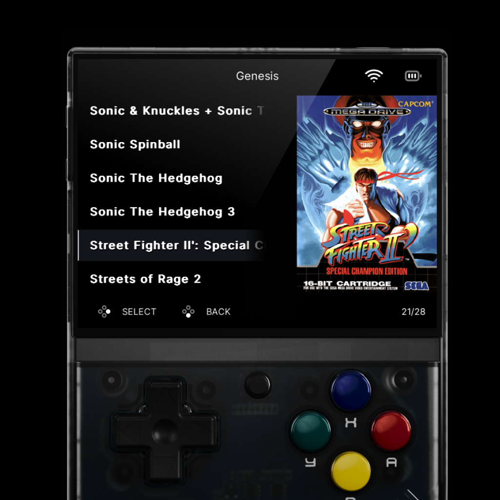
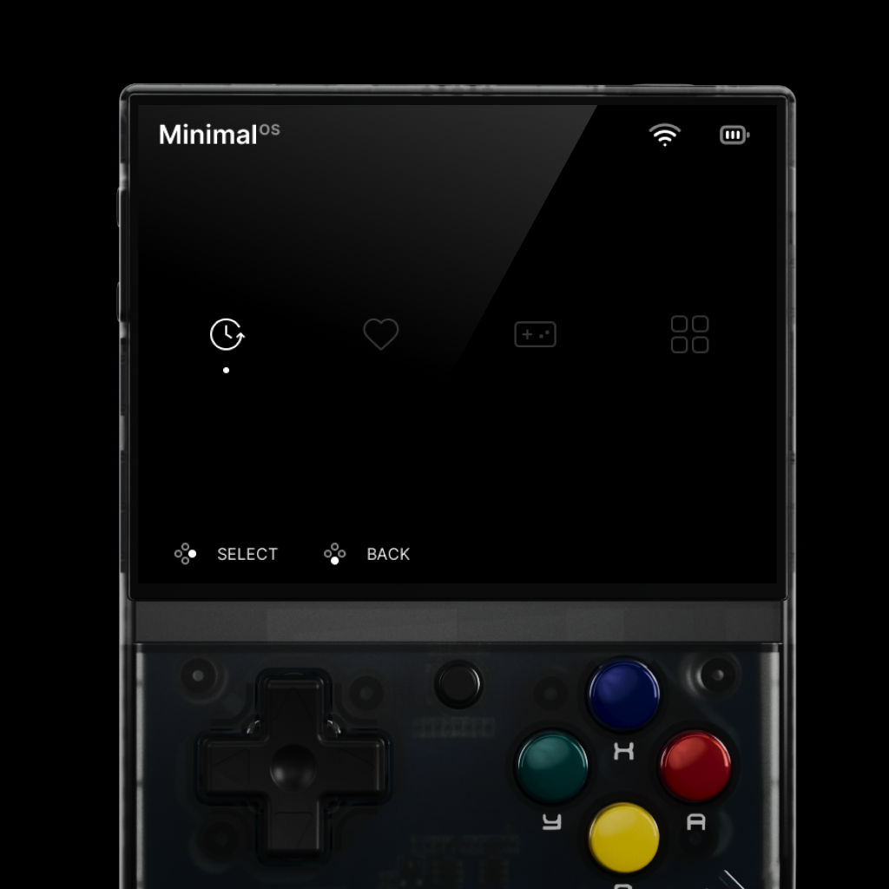
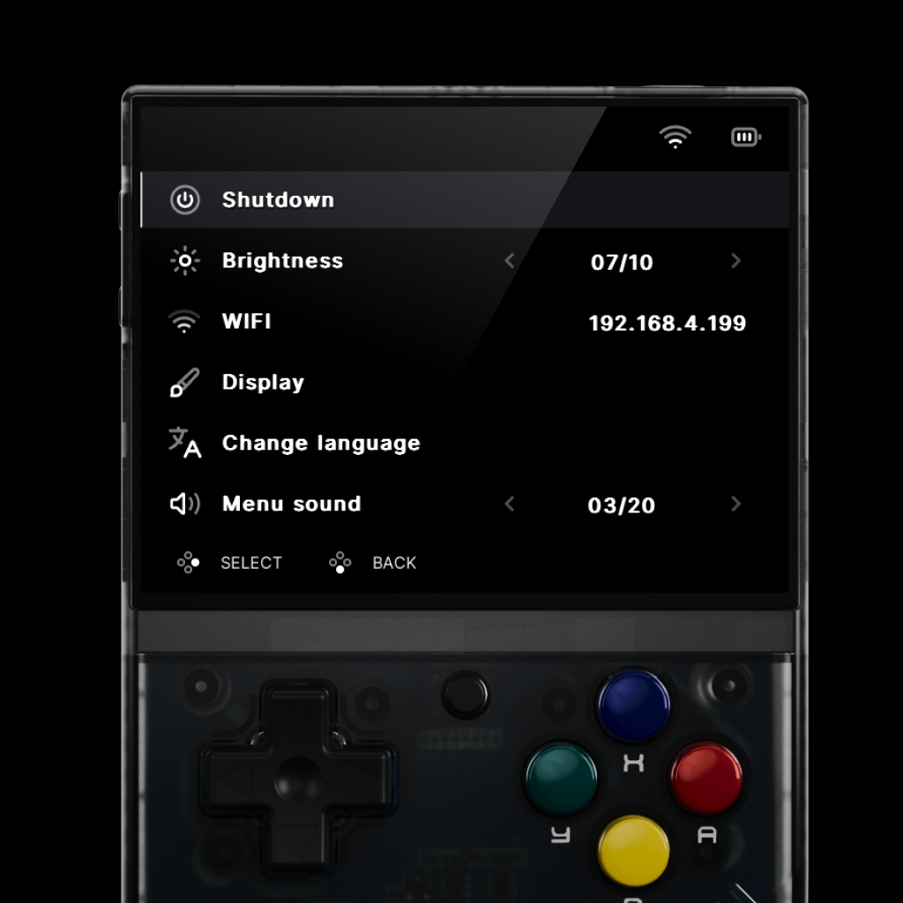
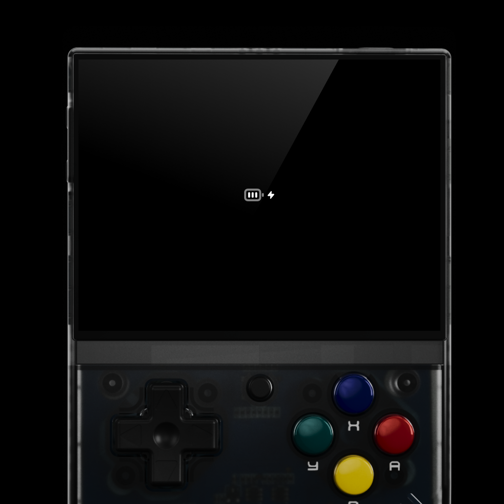

# MinimalOS - Theme for Miyoo Mini and Onion OS

Provided to the community as is. All assets are provided free.
Each assets needs to be added to the relevant folder in your own Micro SD.
Follow the instruction on the OnionOS official website for more detail.

## NOTE: Sounds are optional

If you don't want the retro Golden Axe 2 Sounds in the theme, do not copy the sound folder to your SD card

## Custom loaders and battery screens

In order to replace the loading screens and battery screens Place the extra files in the current user theme
as mentioned [here](https://onionui.github.io/docs/theme-design#theme-overrides)

### FIGMA theme file

I may release it to the community if people request it

[FIGMA FILE](https://www.figma.com/file/1DrDikIH6lo8RuhxXf3doM/Minimal-OS---Figma-Template?type=design&node-id=0%3A1&mode=design&t=6srTkUAmQYUvuD6D-1)

Previews

